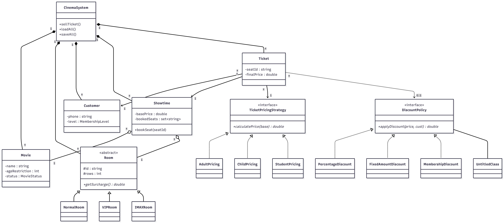

# Cinema Management System

## 1. Program Description
Cinema Management System là một ứng dụng Console viết bằng C++ để quản lý rạp chiếu phim mini. Hệ thống cho phép nhân viên rạp chiếu thực hiện đầy đủ các nghiệp vụ như quản lý phim, phòng chiếu, suất chiếu, khách hàng, bán vé, tính toán khuyến mãi đa dạng, cũng như thống kê doanh thu theo thời gian thực. Dự án được thiết kế chặt chẽ theo tư duy Hướng Đối Tượng (OOP) kết hợp với các mẫu thiết kế (Design Patterns) để đảm bảo tính mở rộng và dễ bảo trì.

## 2. Build Instructions
Dự án sử dụng **CMake** làm hệ thống build mặc định và yêu cầu trình biên dịch hỗ trợ C++17 trở lên. Project cũng tích hợp sẵn thư viện GoogleTest (được CMake tự động tải về qua FetchContent) phục vụ cho việc kiểm thử.

```bash
# 1. Tạo thư mục build
mkdir build
cd build

# 2. Cấu hình project
cmake ..

# 3. Biên dịch project (chương trình chính + các file test)
cmake --build . --config Debug
```

## 3. Run Instructions
Sau khi build thành công, bạn có thể chạy file thực thi tương ứng:

**Chạy chương trình chính:**
```bash
# Trên Windows
.\build\CinemaManagementMini.exe

# Trên Linux/Mac
./build/CinemaManagementMini
```

**Chạy kiểm thử (Unit Tests):**
Hệ thống test được chia làm nhiều file. Bạn có thể sử dụng CTest để chạy toàn bộ:
```bash
cd build
ctest --output-on-failure
```

## 4. Implemented Features
Toàn bộ các yêu cầu chức năng cốt lõi đều đã được hoàn thiện 100%:
- **Quản lý Phim:** Thêm, cập nhật, ngừng chiếu, tìm kiếm, lọc theo thể loại.
- **Quản lý Phòng chiếu:** Hỗ trợ 3 loại phòng (Normal, VIP, IMAX) với các mức phụ thu khác nhau, hỗ trợ sơ đồ lưới 2D không giới hạn số lượng cột.
- **Quản lý Suất chiếu:** Tạo suất chiếu mới có kiểm tra chống trùng lặp giờ chiếu (kèm thời gian dọn dẹp 15 phút).
- **Quản lý Khách hàng:** Đăng ký thành viên, hệ thống cấp bậc (Normal, Silver, Gold), theo dõi lịch sử chi tiêu.
- **Bán Vé:** Kiểm tra tuổi, kiểm tra ghế đã đặt, sinh ID tự động không trùng lặp, tính tiền tự động dựa trên độ tuổi, hạng phòng và mã giảm giá.
- **Thống kê Doanh thu:** Xuất báo cáo tổng quan, báo cáo theo phim, và top 3 phim doanh thu cao nhất.
- **Lưu trữ dữ liệu:** Tự động nạp dữ liệu khi khởi động và lưu toàn bộ xuống đĩa trước khi thoát.
- **Tính năng :** Tự động sinh ID theo quy tắc chuẩn (Auto-generate IDs) giúp chống trùng lặp dữ liệu triệt để. Tìm kiếm ID không phân biệt chữ hoa, chữ thường (Case-insensitive search).
- **Đảm bảo tính ổn định:** "Fail-safe" toàn diện — hệ thống bắt mọi Exception, không bao giờ bị Crash trước các input độc hại hay dữ liệu lỗi từ file.

## 5. Missing Features
- Không có (Tất cả tính năng yêu cầu trong assignment đều đã được implement).

## 6. Sơ đồ Lớp (Class Diagram)
Kiến trúc hệ thống tận dụng các Lớp Trừu Tượng (Abstract Classes) và Interface nhằm giảm sự phụ thuộc (Coupling) và tăng tính liên kết (Cohesion). Sơ đồ dưới đây thể hiện các mối quan hệ (Relationships) cốt lõi:




## 7. Giải thích Thiết kế Hướng Đối Tượng (OOP & Design Patterns)
Dự án được thiết kế chuẩn chỉnh theo mô hình OOP và tuân thủ nghiêm ngặt các nguyên lý thiết kế phần mềm hiện đại:

### A. OOP
1. **Encapsulation (Tính đóng gói):**
   - Toàn bộ dữ liệu thành viên (member variables) của các lớp thực thể (`Movie`, `Room`, `Customer`, `Showtime`, `Ticket`, `Seat`) đều được khai báo là `private` hoặc `protected` để ngăn chặn việc can thiệp dữ liệu trái phép từ ngoài phạm vi lớp.
   - Các lớp chỉ cung cấp các phương thức truy xuất an toàn (Getters/Setters) và đóng gói các hành vi nghiệp vụ cụ thể. Ví dụ: Lớp `Showtime` đóng gói toàn bộ trạng thái danh sách ghế đã đặt `bookedSeats` dưới dạng `std::set<std::string>`, và việc thay đổi trạng thái này bắt buộc phải thông qua phương thức `bookSeat(seatId)` hoặc `cancelSeatBooking(seatId)` để kiểm soát tính hợp lệ của ghế.
2. **Inheritance (Tính kế thừa):**
   - Tổ chức hệ thống phân cấp lớp rõ ràng:
     - Phân cấp Phòng chiếu: Lớp cơ sở `Room` được kế thừa bởi các lớp con cụ thể: `NormalRoom`, `VIPRoom`, và `IMAXRoom`.
     - Phân cấp Khuyến mãi: Interface `DiscountPolicy` được kế thừa bởi `PercentageDiscount`, `FixedAmountDiscount`, và `MembershipDiscount`.
     - Phân cấp Tính giá: Interface `TicketPricingStrategy` được kế thừa bởi `AdultPricing`, `ChildPricing`, và `StudentPricing`.
3. **Polymorphism (Tính đa hình):**
   - **Đa hình Động (Dynamic Binding / Runtime Polymorphism):** 
     - Lớp `Room` định nghĩa phương thức thuần ảo `virtual double getSurcharge() const = 0`. Khi chạy chương trình, tuỳ thuộc vào đối tượng phòng chiếu thực tế là gì để gọi đúng logic tính phụ thu tương ứng (Normal: 0đ, VIP: 20.000đ, IMAX: 50.000đ).
     - Điều này tương tự với `DiscountPolicy::applyDiscount()` và `TicketPricingStrategy::calculatePrice()`, giúp hệ thống có thể đối xử đồng nhất với mọi loại chính sách/phòng chiếu mà không cần biết chi tiết kiểu dữ liệu cụ thể lúc biên dịch.
4. **Abstraction (Tính trừu tượng):**
   - Sử dụng các lớp trừu tượng (`Room`, `DiscountPolicy`, `TicketPricingStrategy`) để định nghĩa ra các abstract chung cho hệ thống, giúp ẩn đi các chi tiết cài đặt phức tạp ở tầng dưới. Người sử dụng chỉ cần gọi phương thức thông qua con trỏ lớp cơ sở.

### B. Áp dụng các Nguyên lý SOLID
- **Single Responsibility Principle (SRP - Đơn nhiệm):** Mỗi lớp chỉ chịu trách nhiệm cho một tác vụ nghiệp vụ duy nhất. Ví dụ: `Ticket` chỉ chịu trách nhiệm lưu trữ thông tin vé và in biên lai; `Showtime` chỉ quản lý khung giờ chiếu và danh sách ghế của suất chiếu đó; `CinemaSystem` làm lớp điều phối trung tâm.
- **Open/Closed Principle (OCP - Mở rộng/Đóng kín):** Thiết kế cho phép dễ dàng mở rộng tính năng mới mà không cần sửa đổi mã nguồn hiện tại. Ví dụ: Khi rạp phim muốn thêm loại phòng mới (như phòng 4DX) hoặc chính sách giảm giá mới (giảm giá ngày thứ Tư vui vẻ), ta chỉ cần tạo một lớp con mới kế thừa từ `Room` hoặc `DiscountPolicy` mà không phải sửa đổi bất kỳ logic lõi nào trong `CinemaSystem`.
- **Liskov Substitution Principle (LSP - Thay thế Liskov):** Các lớp con (`VIPRoom`, `IMAXRoom`, `PercentageDiscount`,...) hoàn toàn có thể thay thế cho lớp cha của chúng (`Room`, `DiscountPolicy`) mà không làm thay đổi tính đúng đắn của chương trình.
- **Interface Segregation Principle (ISP - Phân tách Giao diện):** Giao diện của `DiscountPolicy` hay `TicketPricingStrategy` được giữ ở mức cực kỳ tối giản, tập trung vào nhiệm vụ duy nhất (chỉ chứa các hàm thuần ảo cần thiết như `applyDiscount`, `getCode`, `getDescription`), tránh bắt buộc các lớp con phải phụ thuộc các phương thức thừa thãi.
- **Dependency Inversion Principle (DIP - Đảo ngược Phụ thuộc):** Các lớp cấp cao (`CinemaSystem`, `Ticket`) không phụ thuộc trực tiếp vào các lớp cài đặt cụ thể mà phụ thuộc vào các lớp trừu tượng (`Room`, `DiscountPolicy`, `TicketPricingStrategy`).

### C. Design Patterns
- **Strategy Pattern (Chiến lược):** Được sử dụng cho cơ chế tính giá vé (`TicketPricingStrategy` áp dụng cho Người lớn, Trẻ em, Sinh viên) và tính mã giảm giá (`DiscountPolicy`). Việc tách biệt thuật toán tính giá ra khỏi thực thể vé giúp thay đổi chiến lược tính giá vé linh hoạt tại thời điểm Runtime.

- **RAII & Modern Memory Management:** Quản lý tài nguyên an toàn bằng con trỏ thông minh:
  - Sử dụng `std::shared_ptr` cho các đối tượng đa hình cần chia sẻ quyền sở hữu như `Room` và `DiscountPolicy` (để tránh rò rỉ bộ nhớ khi lưu trữ trong container).
  - Sử dụng `std::unique_ptr` cho `TicketPricingStrategy` vì nó chỉ cần tồn tại tạm thời trong quá trình tính giá vé và in vé, tự động giải phóng vùng nhớ khi ra khỏi phạm vi hàm.

## 8. Cấu trúc Lưu trữ Dữ liệu & Cơ chế Ràng buộc (Data Storage & Constraints)
Hệ thống sử dụng (`.txt`) để lưu trữ dữ liệu tại thư mục `data/`. .

### Định dạng File 
Dữ liệu của mỗi thực thể được biểu diễn trên một dòng riêng biệt, phân tách bằng ký tự  `|` :
- `movies.txt`: `ID | Tên phim | Thể loại | Thời lượng (phút) | Tuổi tối thiểu | Trạng thái`
- `rooms.txt`: `ID | Tên phòng | Loại phòng (Normal/VIP/IMAX) | Số hàng | Số ghế/hàng`
- `customers.txt`: `ID | Họ tên | Tuổi | Số điện thoại | Hạng thành viên`
- `showtimes.txt`: `ID | Movie ID | Room ID | Ngày chiếu | Giờ chiếu | Giá vé gốc`
- `tickets.txt`: `ID | Customer ID | Showtime ID | Ghế | Loại vé | Giá cuối cùng`

### Quy trình Đồng bộ Dữ liệu An toàn (Robust Data Sync Flow)
1. **Nạp dữ liệu:** Khi khởi động ứng dụng gọi `loadAll()`, các file được nạp theo thứ tựtừ thực thể độc lập đến thực thể phụ thuộc: 
   $$\text{Movies/Rooms/Customers} \rightarrow \text{Showtimes} \rightarrow \text{Tickets}$$
   Điều này đảm bảo mọi khóa ngoại đều có thể được load an toàn.
2. **Lấy trạng thái Ghế(seat)** 
   - Danh sách các ghế đã được đặt không được lưu cứng trong file `showtimes.txt` để tránh dư thừa và không nhất quán dữ liệu.
   - Thay vào đó, sau khi nạp xong danh sách Vé từ `tickets.txt`, hệ thống sẽ kích hoạt hàm `reconcileShowtimeSeats()`. Hàm này sẽ duyệt qua toàn bộ các vé đã bán, tìm suất chiếu tương ứng và tự động đánh dấu đặt chỗ cho các ghế đó trên RAM.
4. **Ghi tệp nguyên khối (Atomic-like Writing):**
   - Toàn bộ thao tác thêm, sửa, xóa dữ liệu trong suốt phiên đều thực hiện cực kỳ nhanh trên RAM (In-memory).
   - Khi người dùng chọn Lưu dữ liệu hoặc khi thoát chương trình một cách an toàn, hệ thống sẽ mở các file ở chế độ ghi đè (`std::ios::trunc`), ghi toàn bộ dữ liệu hiện tại từ RAM xuống đĩa cứng một cách đồng bộ trong tích tắc.

## 9. Program Screenshots or Logs
Dưới đây là một số giao diện (Console Logs) thực tế của chương trình khi hoạt động:

### 1. Main Menu (Giao diện chính)
```txt
========== CINEMA MANAGEMENT ==========
1. Movie management
2. Room management
3. Showtime management
4. Customer management
5. Sell ticket
6. View tickets
7. Revenue report
8. Save data
9. Load data
0. Exit
=======================================
Choose: 
```

### 2. Các Menu Quản lý (Management Sub-menus)

#### Movie Management (Option 1)
```txt
--- MOVIE MANAGEMENT ---
1. Add movie
2. Update movie
3. Stop movie
4. Search by name
5. Filter by genre
6. Display all movies
0. Back
Choose: 
```

#### Room Management (Option 2)
```txt
--- ROOM MANAGEMENT ---
1. Add room
2. Update room
3. Display all rooms
0. Back
Choose: 
```

#### Showtime Management (Option 3)
```txt
--- SHOWTIME MANAGEMENT ---
1. Add showtime
2. Display all showtimes
0. Back
Choose: 
```

#### Customer Management (Option 4)
```txt
--- CUSTOMER MANAGEMENT ---
1. Add customer
2. Update customer
3. Display all customers
0. Back
Choose: 
```

### 3. Bán Vé (Ticket Selling & Seat Layout)
```txt
===== SELL TICKET =====
Enter Showtime ID: S001

Seat Layout for Screen 1 (VIP) - Showtime S001:
Total Seats: 40 | Booked: 4 | Available: 36

   1 2 3 4 5 6 7 8 
A  X X O O O O O O 
B  X X O O O O O O 
C  O O O O O O O O 
D  O O O O O O O O 
E  O O O O O O O O 
(O = Available, X = Booked)

Customer ID (or phone number to search): 0904567890
[C004] Hoang Thi D | Age: 22 | Phone: 0904567890 | Member: Gold
Seat (e.g. A1): C1
Ticket type:
  1. Adult (full price)
  2. Child (30% off)
  3. Student (20% off)
Choose: 1

===== DISCOUNT CODES =====
  GOLD  ->  15% off (membership required)
  SILVER  ->  5% off (membership required)
  FIX20K  ->  20000 VND off
  SALE10  ->  10% off
Discount code (press Enter to skip): GOLD

========= TICKET =========
Ticket ID:      T021
Customer:       Hoang Thi D
Movie:          Dune 2
Room:           Screen 1 - VIP
Showtime:       2026-05-27 19:00
Seat:           C1
Ticket type:    Adult
Base price:     90000 VND
Room surcharge: 20000 VND
Discount:       16500 VND (GOLD)
Final price:    93500 VND
==========================
```

### 4. Minh họa các Tình huống sử dụng thực tế (Use-Cases Logs)

**1. Thêm phim thành công**
```txt
--- MOVIE MANAGEMENT ---
1. Add movie
2. Update movie
3. Stop movie
...
Choose: 1
Movie name: Avengers: Endgame
Genre: Action
Duration (minutes): 181
Age restriction: 13
[OK] Movie added. Generated ID: M005
```

**2. Tạo suất chiếu hợp lệ**
```txt
--- SHOWTIME MANAGEMENT ---
1. Add showtime
2. Display all showtimes
0. Back
Choose: 1
Movie ID: M001
Room ID: P01
Date (YYYY-MM-DD): 2026-06-05
Start time (HH:MM): 19:30
Base ticket price (VND): 100000
[OK] Showtime added. Generated ID: ST07
```

**3. Tạo suất chiếu bị trùng lịch (Báo lỗi)**
```txt
Choose: 1
Movie ID: M002
Room ID: P01
Date (YYYY-MM-DD): 2026-06-05
Start time (HH:MM): 20:00
Base ticket price (VND): 80000
[ERROR] Showtime conflicts with ST07 in room P01 (including 15-min cleanup).
```

**4. Bán vé ghế đã đặt (Báo lỗi)**
```txt
Seat (e.g. A1): C1
Ticket type:
  1. Adult (full price)
Choose: 1
Discount code (press Enter to skip): 
[ERROR] Seat C1 is already booked for showtime ST01.
```

**5. Khách chưa đủ tuổi (Báo lỗi)**
```txt
Customer ID (or phone number to search): 0902345678
[C002] Tran Thi B | Age: 10 | Phone: 0902345678 | Member: Normal
Seat (e.g. A1): D2
Ticket type:
  1. Adult (full price)
Choose: 1
Discount code (press Enter to skip): 
[ERROR] Customer age (10) is below movie age restriction (13+).
```

**6. Tính giá vé Trẻ em (Giảm 30%) & Sinh viên (Giảm 20%)**
```txt
Ticket type:
  1. Adult (full price)
  2. Child (30% off)
  3. Student (20% off)
Choose: 3

========= TICKET =========
Ticket ID:      T025
Ticket type:    Student
Base price:     80000 VND
Room surcharge: 0 VND
Discount:       0 VND
Final price:    80000 VND
==========================
```

**7. Áp dụng mã giảm giá thành công**
```txt
Ticket type:
  1. Adult (full price)
  2. Child (30% off)
  3. Student (20% off)
Choose: 1

===== DISCOUNT CODES =====
  GOLD  ->  15% off (membership required)
  SILVER  ->  5% off (membership required)
  FIX20K  ->  20000 VND off
  SALE10  ->  10% off
Discount code (press Enter to skip): FIX20K

========= TICKET =========
Ticket type:    Adult
Base price:     100000 VND
Room surcharge: 20000 VND
Discount:       20000 VND (FIX20K)
Final price:    100000 VND
==========================
```

### 5. Báo Cáo Doanh Thu (Revenue Statistics)
```txt
========= REVENUE REPORT =========
Total tickets sold: 20
  - Adult:   10
  - Child:   5
  - Student: 5
Total revenue: 1451000 VND
Seat occupancy rate: 6.9%

Revenue by movie:
  1. Dune 2: 560000 VND (8 tickets)
  2. Inside Out 2: 450500 VND (6 tickets)
  3. The Dark Knight: 332500 VND (4 tickets)
  4. Toy Story 4: 108000 VND (2 tickets)

Revenue by date:
  2026-05-27: 560000 VND
  2026-05-28: 630000 VND
  2026-05-29: 261000 VND

Top 3 highest revenue movies:
  1. Dune 2: 560000 VND
  2. Inside Out 2: 450500 VND
  3. The Dark Knight: 332500 VND
==================================
```

## 10. Unit Testing (Kiểm thử tự động)
Dự án được tích hợp bộ Unit Test sử dụng framework **GoogleTest** (được cấu hình tự động tải qua CMake FetchContent).
Bộ test bao phủ 100% các yêu cầu kiểm tra (20 Test Cases cốt lõi), bao gồm:
1. Thêm phim thành công / Báo lỗi thời lượng không hợp lệ.
2. Tạo suất chiếu hợp lệ / Chặn trùng lịch suất chiếu.
3. Bán vé ghế trống / Chặn bán vé ghế đã có người đặt.
4. Chặn khách hàng chưa đủ tuổi.
5. Tính giá vé trẻ em (30% off) / sinh viên (20% off) chuẩn xác.
6. Áp dụng mã giảm giá và tích lũy chi tiêu khách hàng chính xác.


Để chạy test, sử dụng lệnh:
```bash
ctest --output-on-failure
```
